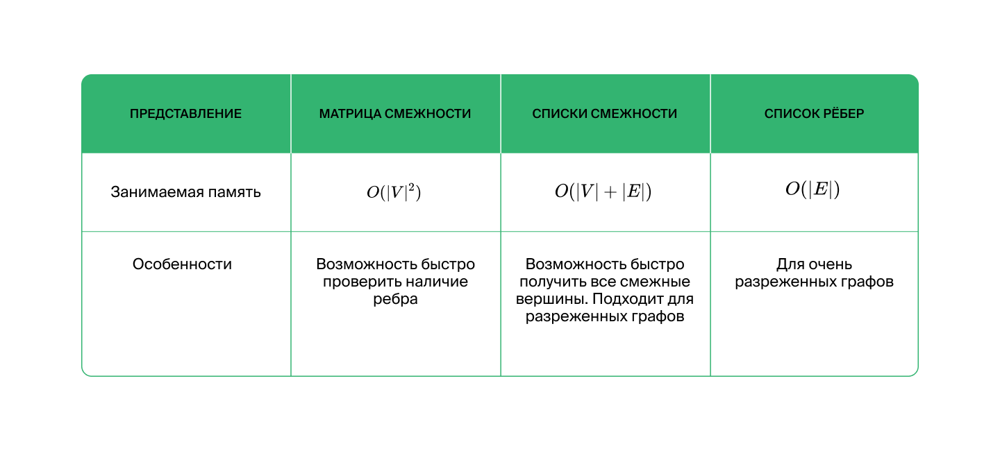

# Представление в виде матрицы смежности

Создается квадратная матрица размера VxV где V - кол-во вершин.
Между двумя вершинами ставится 1, если есть путь. Если 1 стоит у индексов [x][y] и у [x][y] значит, что путь есть в оба направления.

# Представление в виде списка смежности

Ниже - преобразование списка ребер в список смежности
Для каждой вершины храним список вершин, с которой у этой вершины есть исходящее ребро.
def main():
    n, m = map(int, input().split())
    adjacency_list = [[] for x in range(n)]

    for _ in range(m):
        top, edge = map(int, input().split())
        adjacency_list[top-1].append(edge)

    for high in adjacency_list:
        count = len(high)
        print(count, end=' ')
        if count > 0:
            for edge in high:
                print(edge, end=' ')
        print()

if __name__ == '__main__':
    main()

